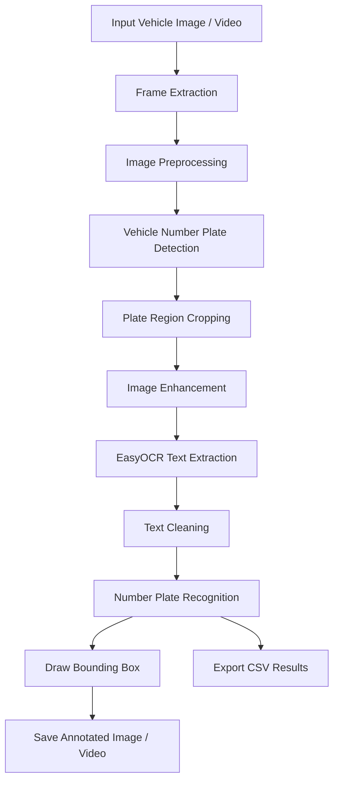

# ANPR Processing Pipeline

```mermaid
flowchart TD
    A["Input Vehicle Image / Video"]
    B["Frame Extraction"]
    C["Image Preprocessing"]
    D["Vehicle Number Plate Detection"]
    E["Plate Region Cropping"]
    F["Image Enhancement"]
    G["EasyOCR Text Extraction"]
    H["Text Cleaning"]
    I["Number Plate Recognition"]
    J["Draw Bounding Box"]
    K["Save Annotated Image / Video"]
    L["Export CSV Results"]

    A --> B
    B --> C
    C --> D
    D --> E
    E --> F
    F --> G
    G --> H
    H --> I
    I --> J
    J --> K
    I --> L
```
